# PocketNote

KMM project where all podcasts are listed

## Android
| Home                              | Details                                      | Episodes                                  |
|-----------------------------------|----------------------------------------------|-------------------------------------------|
| 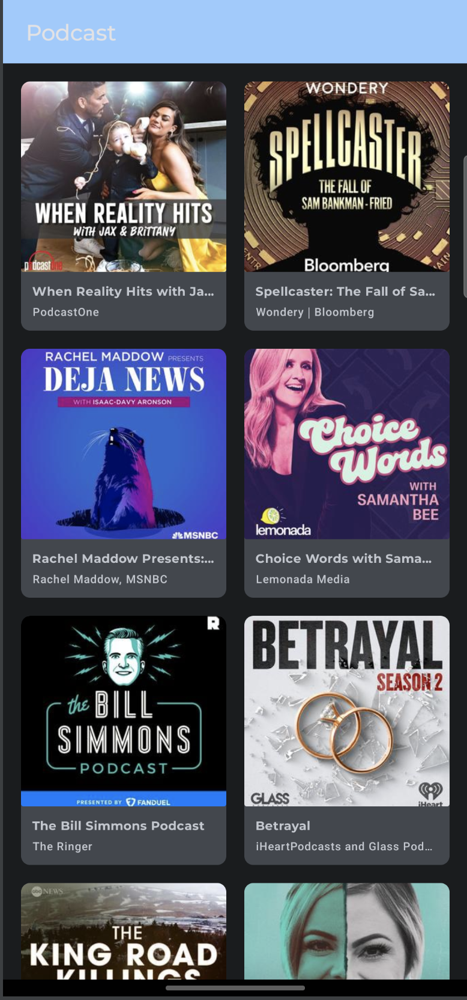 | 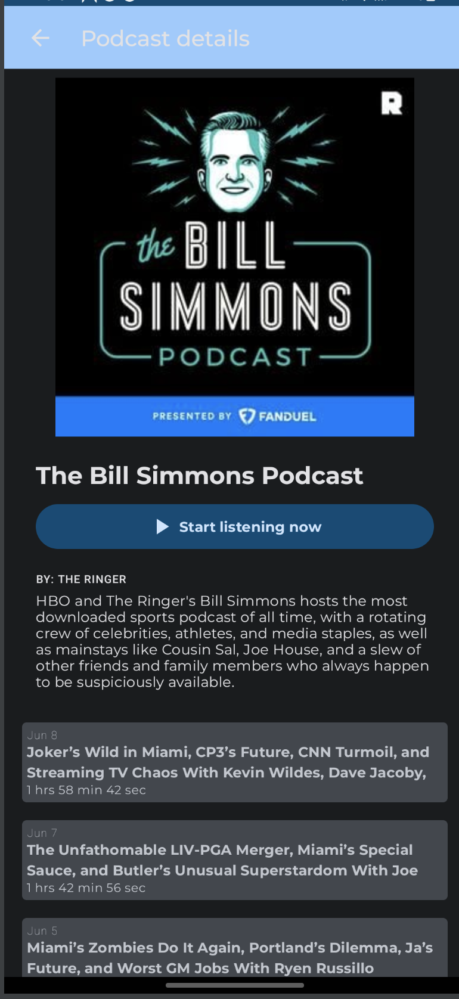 | 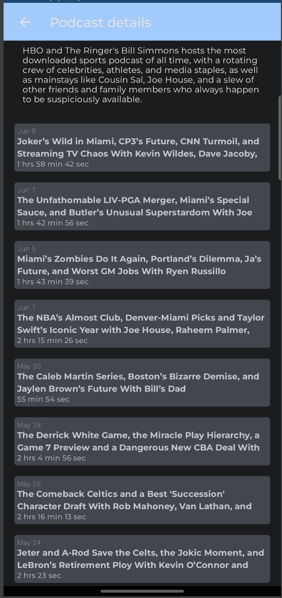 |

## iOS
| Home                      | Details                              | Episodes                          |
|---------------------------|--------------------------------------|-----------------------------------|
| 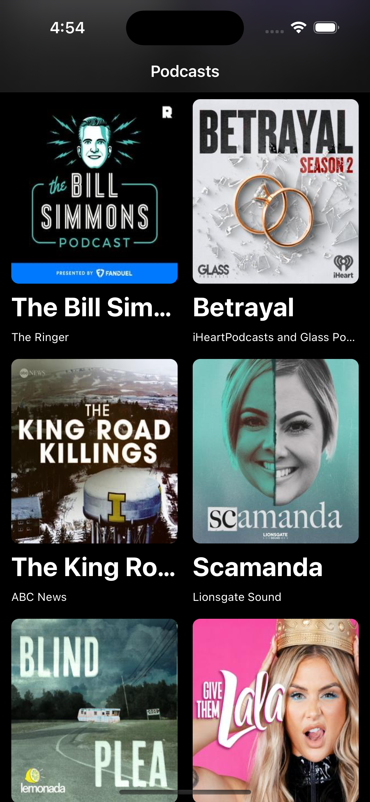 | 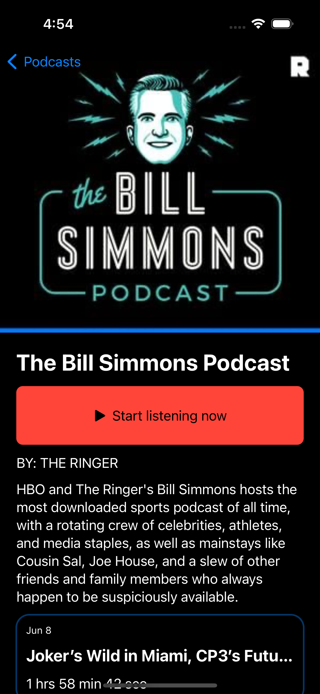 | 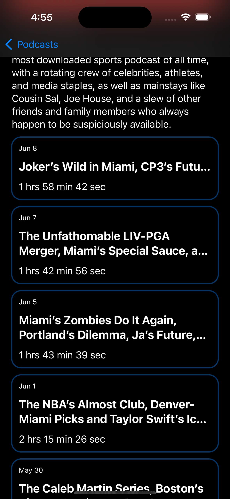 |

## Responsive
| Mobile                           | Foldable                           | Tablet                        | Tablet Curated                        |
|----------------------------------|------------------------------------|-------------------------------|---------------------------------------|
| 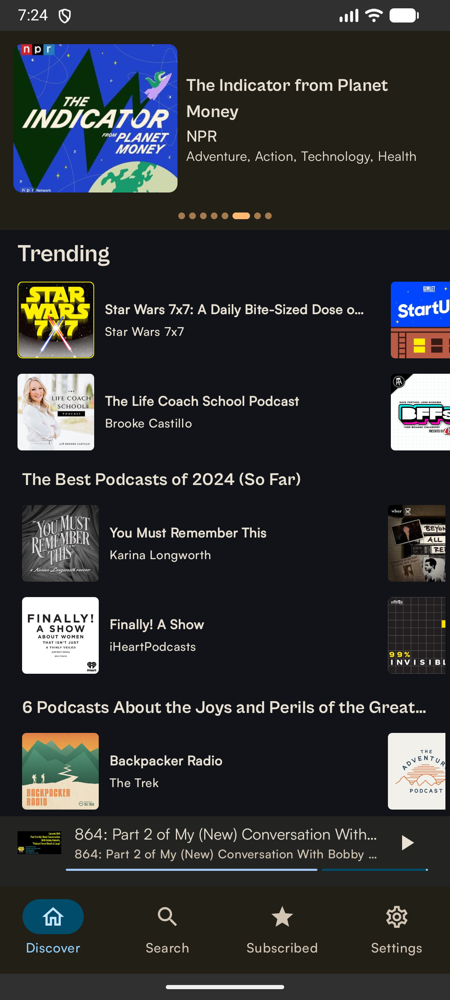 | 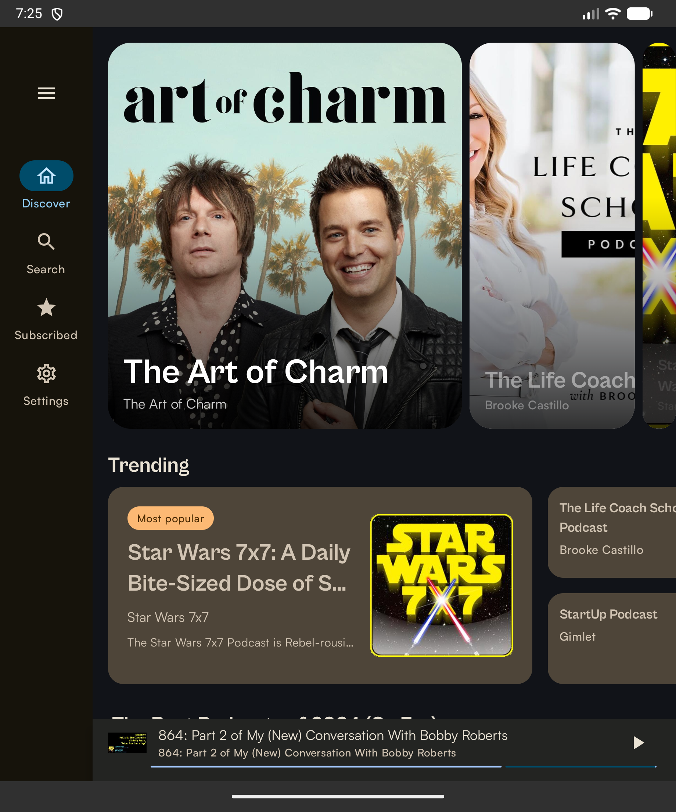 | 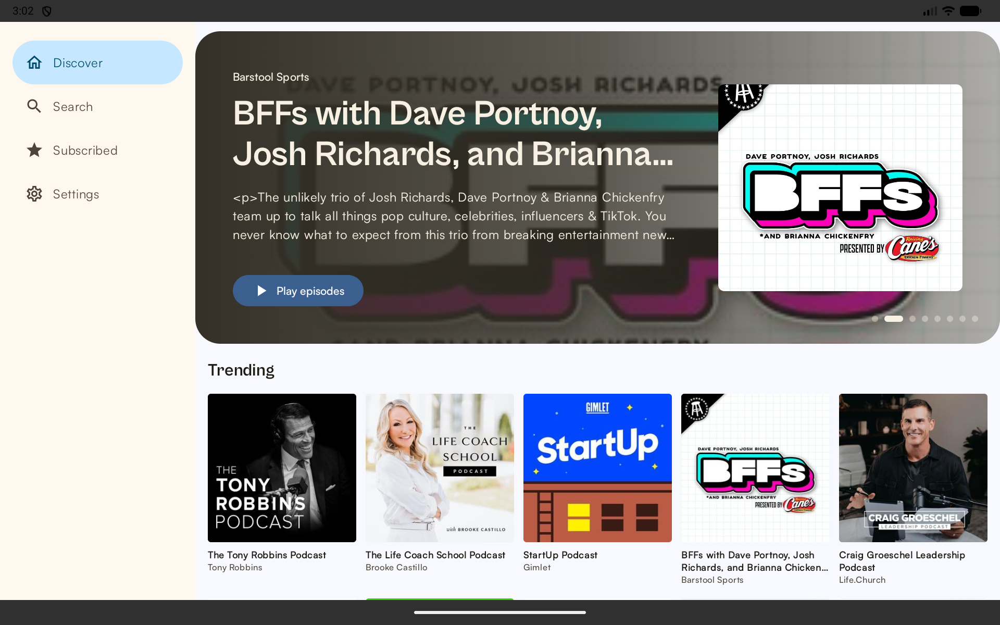 | 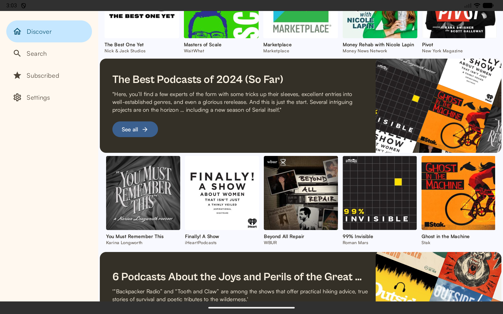 |

## Wear OS

| Podcasts                        | Details (Top header)                    | Details (Episode List)                  |
|---------------------------------|-----------------------------------------|-----------------------------------------|
| 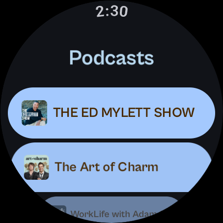 | 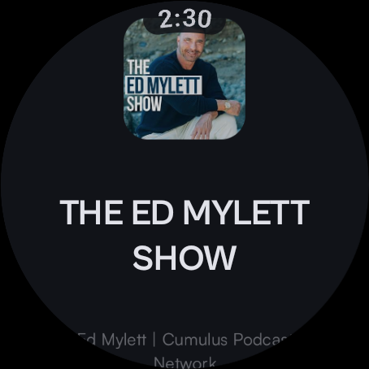 | 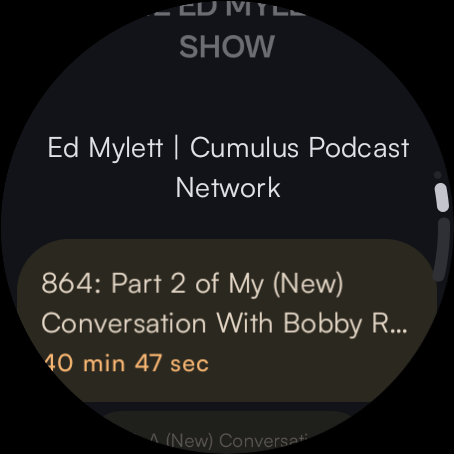 |

## Other Platforms

- **Android TV**: 🚧 Work In Progress (WIP)
- **Android Auto**: 🚧 Work In Progress (WIP)

## Development Tools

This project uses several tools to ensure code quality and documentation consistency.

### Code Formatting (Spotless)

To fix code formatting across the entire project:

```bash
./gradlew spotlessApply
```

### Static Analysis (Detekt)

To run code smell analysis:

```bash
./gradlew detekt
```

### Test Coverage (Kover)

To generate an HTML test coverage report:

```bash
./gradlew koverHtmlReport
```

Reports can be found in `[module]/build/reports/kover/html`.

### API Documentation (Dokka)

To generate the API documentation:

```bash
./gradlew dokkaGenerate
```

The documentation will be generated in `build/dokka/html`.

### AI & Agentic Capabilities

This project implements **Android AppFunctions**, allowing system AI agents to interact with podcast
discovery and playback.

- [AI App Functions Developer Guide](dev/ai_app_functions.md): A complete list of exposed functions
  and ADB commands for testing.

### References
- App icon from [Icon kitchen](https://icon.kitchen/)
